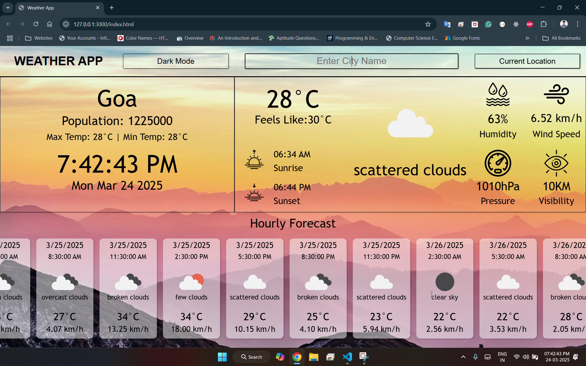

# 🌦 Weather App

A simple weather application that fetches and displays real-time weather data using the OpenWeather API.

## 🚀 Features

- 🌍 Search weather by city name
- 🌡️ Display real-time temperature, humidity, wind speed, and weather conditions
- 📆 Show 5-day forecast with daily temperature trends
- 🌙 Dark mode support
- 📱 Responsive design for all devices

## 🛠 Technologies Used

- HTML, CSS, JavaScript
- OpenWeather API
- Fetch API for asynchronous data handling

## 📸 Screenshots



## 🔧 Installation

1. Clone this repository:
   ```sh
   git clone https://github.com/Tulaseeram-panga/WeatherApp.git
   ```
2. Navigate to the project directory:
   ```sh
   cd WeatherApp
   ```
3. Open `index.html` in your browser or run a local server.

## 🔑 API Setup

1. Get your API key from [OpenWeather](https://openweathermap.org/).
2. Replace `YOURAPIKEY` in `script.js`:
   ```js
   const API_KEY = "YOUR_API_KEY";
   ```

## 🚀 Usage

1. Enter a city name in the search bar.
2. Click the search button or press Enter.
3. View the current weather and 5-day forecast.

## 🤝 Contributing

Feel free to contribute by creating pull requests or reporting issues!

## 📜 License

This project is licensed under the MIT License - see the [LICENSE](LICENSE) file for details.

## ⭐ Show Your Support

If you like this project, give it a ⭐ on GitHub!
